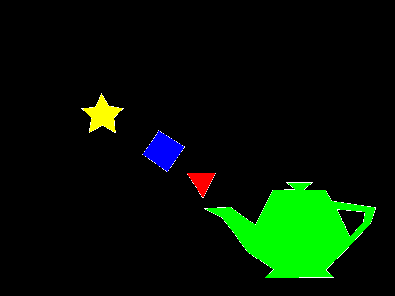

# Laboratorio de Gráficos en Rust

Este proyecto es parte del laboratorio de gráficos en Rust, donde se implementan y dibujan varios polígonos rellenos de sus respectivos colores de relleno y línea. El objetivo es crear una imagen BMP que contenga estos polígonos, siguiendo una estructura específica de branches y commits.

## Estructura del Proyecto

El proyecto está dividido en varios módulos para una mejor organización del código:

- `color.rs`: Manejo de colores, con conversiones entre RGB y valores hexadecimales.
- `bmp.rs`: Escritura de archivos BMP.
- `framebuffer.rs`: Manejo de un framebuffer para dibujar los píxeles.
- `line.rs`: Implementación del algoritmo de Bresenham para dibujar líneas.

## Polígonos Dibujados

Se han creado diferentes branches para dibujar polígonos específicos, siguiendo estos pasos:

1. **Branch `Poligon-1`**:

- Dibuja el primer polígono de color amarillo con orilla blanca.

2. **Branch `Poligon-2`**:

- Dibuja el primer y segundo polígono. El segundo es de color azul con orilla blanca.

3. **Branch `Poligon-3`**:

- Dibuja los tres primeros polígonos. El tercero es de color rojo con orilla blanca.

4. **Branch `Poligon-4`**:

- Dibuja los cuatro primeros polígonos. El cuarto tiene un agujero (quinto polígono) y es de color verde con orilla blanca.

## Archivos Incluidos

- **Código fuente**: Todo el código necesario para dibujar los polígonos está incluido en los módulos mencionados.
- **Imagen de salida**: `output.bmp` contiene el resultado final del dibujo de todos los polígonos.
- **Branches**: Cada branch contiene el código para dibujar los polígonos especificados.

## Uso

### Clonar el repositorio

```sh
git clone https://github.com/SergioAle210/Lab01-GC.git
```

### Cambiar de branch

Para cambiar a una branch específica y ver los polígonos correspondientes, usa:

```
git checkout Poligon-1
```

Reemplaza `Poligon-1` con la branch que deseas ver (`Poligon-2`, `Poligon-3`, `Poligon-4`o `base-structure (contiene toda la estructura base de los polígonos`).

### Compilar el proyecto

```
cargo build
```

### Ejecutar el proyecto

```
cargo run
```

## Resultados

### Imagen de salida


